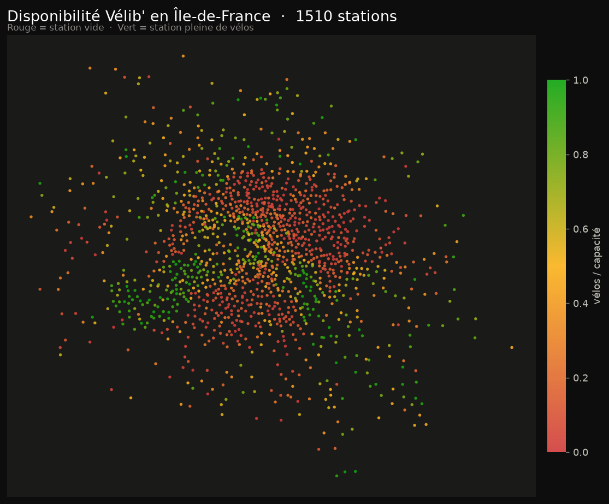
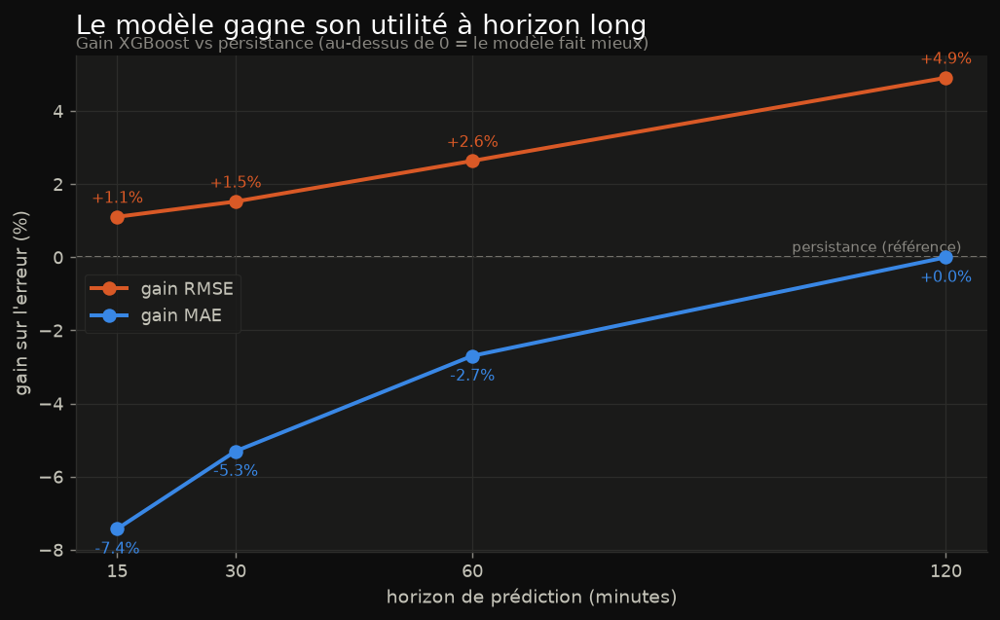

# UrbanFlow 🚲

**Pipeline de données temps réel sur la mobilité urbaine francilienne (Vélib' / IDFM)** —
de l'ingestion d'une API publique jusqu'à un dashboard cartographique et un modèle ML servi
en HTTP.

[](https://github.com/D-Arslan/UrbanFlow/actions/workflows/ci.yml)


> Projet **portfolio** — Data Science / Systèmes Distribués. Chaîne complète
> `API → Kafka → Spark → PostgreSQL/Parquet → ML → FastAPI/Streamlit`, orchestrée par Docker.



> 💡 *L'image ci-dessus est générée depuis les vraies données
> ([`docs/make_figures.py`](docs/make_figures.py)). Le dashboard **Streamlit** live affiche la
> même carte sur un fond OpenStreetMap, avec le détail et la prévision par station.*

---

## 🎯 En bref

UrbanFlow interroge en continu l'API GBFS Vélib', fait transiter les mesures par **Kafka**,
les nettoie et les agrège en fenêtres de 5 min avec **Spark Structured Streaming**, puis les
range dans deux stockages complémentaires : **PostgreSQL** (état chaud, temps réel) et
**Parquet/MinIO** (historique froid). Sur cet historique, une couche **ML** prédit la
disponibilité future des stations. Le tout est exposé par une **API FastAPI** et un
**dashboard Streamlit**, sous **CI GitHub Actions**.

## 🔬 Résultat ML clé — le plafond de signal & la courbe de lift

Le cœur *data science* du projet n'est pas un modèle « qui gagne », mais un **diagnostic
rigoureux** :

- À **court terme (t+15 / t+30 min)**, la **persistance** (« dans 15 min ≈ maintenant ») est
  **quasi-optimale** : trois familles de modèles (XGBoost absolu, XGBoost delta/L1, GRU) ne la
  battent pas nettement. C'est un **plafond de signal** — la limite est dans la *donnée*, pas
  dans le modèle.
- À **horizon long (t+60 / t+120 min)**, le modèle **prend l'avantage** sur les cas volatils
  (heures de pointe) : il rabote les grosses erreurs (**RMSE**), avec un gain **croissant**.



> La leçon d'ingénieur : **ne pas déployer de complexité sans gain mesuré**. On sert donc la
> persistance (honnêtement étiquetée) tout en gardant une abstraction prête à brancher le vrai
> modèle. Détails : [`learning.md`](learning.md) §6.8–6.10 et §8.3.

## 🏗️ Architecture

```
API GBFS Vélib'
      │  poller Python (ingestion/poller.py)
      ▼
   Kafka  (KRaft, sans Zookeeper)
      │
      ▼
Spark Structured Streaming
   (nettoyage · fenêtres 5 min · watermark)
      │
      ├──► PostgreSQL      état chaud (dernier état par station)
      └──► Parquet / MinIO historique froid (partitionné par date)
                 │
                 ▼
              ML  baseline persistance · XGBoost · GRU
                 │
                 ▼
        FastAPI (JSON)  ──►  Streamlit (carte + prévisions)
```

## 🧰 Stack technique

| Couche | Techno |
|--------|--------|
| Ingestion | Python 3.12 (`requests`, `kafka-python`) |
| Streaming | Apache Kafka 3.9 (**KRaft**) |
| Traitement | Apache Spark 3.5 (Structured Streaming) |
| Stockage chaud | PostgreSQL 16 |
| Stockage froid | Parquet / MinIO (S3) |
| ML | scikit-learn · **XGBoost** · **PyTorch (GRU)** |
| Service | **FastAPI** + **Streamlit** |
| Orchestration | Docker Compose |
| Qualité | **pytest** + **ruff** + **GitHub Actions** |

## ✅ Avancement

- [x] **Sprint 1** — Repo + Docker Compose (Kafka KRaft + PostgreSQL) + poller + consumer.
- [x] **Sprint 2** — Spark Structured Streaming : fenêtres 5 min + watermark, upsert PostgreSQL,
  Parquet/MinIO partitionné (1513 stations en base).
- [x] **Sprint 3** — ML : dataset anti-leakage (split temporel + embargo), baseline persistance,
  XGBoost (v1/v2), GRU ; **plafond de signal** mesuré, puis **courbe de lift** à horizon long.
- [x] **Sprint 4** — API FastAPI (`/stations`, `/forecast`, `/forecast_model`) + dashboard
  Streamlit + tests + CI.

## 🚀 Démarrage rapide

```powershell
# 1. Config + infra (Kafka + PostgreSQL + MinIO)
copy .env.example .env          # puis ajuster les valeurs
docker compose up -d
docker compose ps               # tout doit etre "healthy"

# 2. Environnement Python
python -m venv .venv
.\.venv\Scripts\Activate.ps1
pip install -r requirements.txt

# 3. Ingestion (producer) — dans un terminal
python ingestion\poller.py

# 4. API FastAPI — autre terminal        -> http://localhost:8000/docs
uvicorn api.main:app --reload

# 5. Dashboard Streamlit — autre terminal -> http://localhost:8501
streamlit run dashboard\app.py
```

> ℹ️ `POSTGRES_PORT` (dans `.env`) sert à la fois de port publié par Docker et de port de
> connexion de l'API/dashboard. Le mettre à `5433` si un PostgreSQL est déjà installé sur `5432`.

## 🧪 Tests & qualité

```powershell
pip install -r requirements-dev.txt
ruff check api dashboard tests    # lint
pytest                            # tests (API isolée de la base via monkeypatch)
```

La **CI** (`.github/workflows/ci.yml`) rejoue lint + tests à chaque push / PR, sur des
dépendances allégées (ni Spark ni torch) → runner rapide.

## 📚 Documentation

Le fichier [`learning.md`](learning.md) est un **journal pédagogique** complet : chaque
concept (Kafka, Spark, watermark, leakage, MAE/RMSE, FastAPI, CI…) y est expliqué avec
*Définition · Rôle · Pourquoi ce choix · Alternatives · Angle recruteur*, plus une section
« Questions type recruteur » par sprint et un glossaire.

## 🗂️ Structure

```
UrbanFlow/
├── ingestion/poller.py     # producer : API GBFS -> Kafka
├── consumer/               # consumer de test (validation)
├── spark/streaming_job.py  # Spark Structured Streaming
├── ml/                     # dataset, baseline, XGBoost, GRU, inférence
├── api/                    # API FastAPI (service)
├── dashboard/              # dashboard Streamlit (présentation)
├── tests/                  # tests pytest
├── docs/                   # figures du README (générées)
├── docker-compose.yml
└── learning.md             # journal pédagogique
```

## 📄 Licence

[MIT](LICENSE) — libre de réutilisation.
