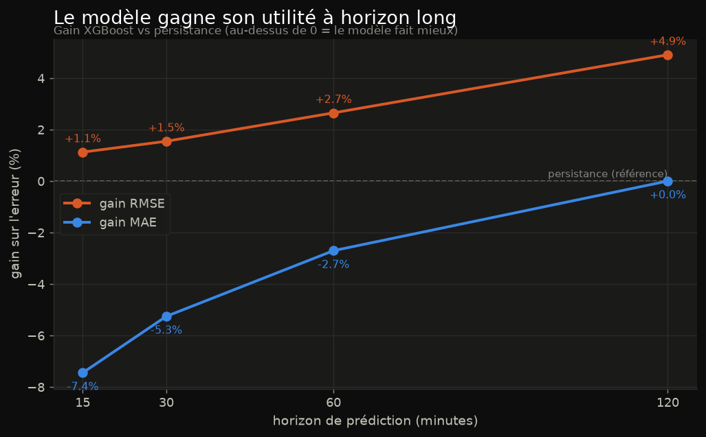
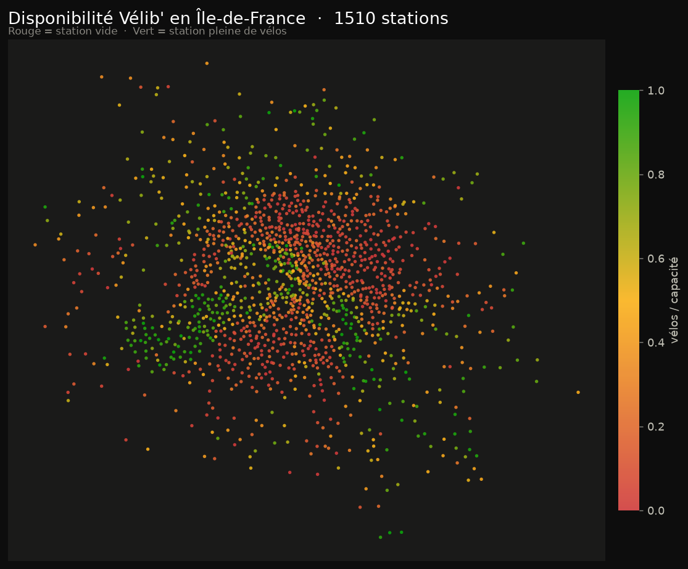
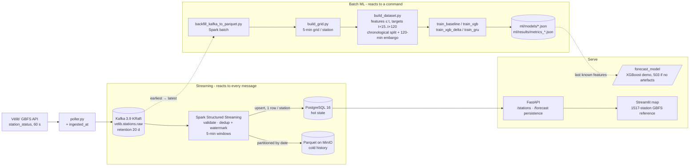

# UrbanFlow

Real-time data pipeline on Paris bike-sharing (Vélib', 1517 stations): GBFS API → Kafka →
Spark Structured Streaming → PostgreSQL + Parquet → XGBoost / GRU → FastAPI + Streamlit, with
one measured result: **at 15 to 30 minutes, "same as now" is almost unbeatable, and the model
only earns its place at 2 hours on the volatile cases.**

[](https://github.com/D-Arslan/UrbanFlow/actions/workflows/ci.yml)

The pipeline is the subject; the model is the test of whether the pipeline produced data worth
modelling. Three model families were tried against the persistence baseline, none was deployed
without a measured gain, and the API says which method it serves.

## Problem → Result

A rider wants to know whether a station will still have bikes when they arrive. The naive
answer, *persistence* ("in 15 minutes, same as now"), is free. A model is only worth its
complexity if it beats that, on the same test period, with no information from the future.



| horizon | MAE persistence | MAE XGBoost | gain MAE | RMSE persistence | RMSE XGBoost | gain RMSE |
|---|---|---|---|---|---|---|
| t+15 | 0.754 | 0.810 | −7.4 % | 1.446 | 1.430 | +1.1 % |
| t+30 | 1.188 | 1.251 | −5.3 % | 2.098 | 2.066 | +1.5 % |
| t+60 | 1.818 | 1.867 | −2.7 % | 3.035 | 2.955 | +2.6 % |
| t+120 | 2.764 | 2.764 | 0.0 % | 4.419 | 4.202 | +4.9 % |

Source: [ml/results/metrics_xgb.json](ml/results/metrics_xgb.json), written by
[ml/train_xgb.py](ml/train_xgb.py) on 2026-09-16 from the locally kept dataset of the July run
(1 566 818 rows, 1510 stations, 2026-07-01 to 2026-07-05, 5-minute grid). Chronological
80/20 split with a 120-minute embargo, about 300 000 test rows per horizon. The figure is drawn
from the same file by [docs/make_figures.py](docs/make_figures.py). Errors are in bikes.

Three findings, details and caveats in [docs/DESIGN.md](docs/DESIGN.md):

- **A signal ceiling at short horizons.** XGBoost on absolute counts, XGBoost on the delta
  with an L1 objective, and a GRU on the raw 60-minute sequence all converge to persistence at
  t+15 and t+30 (delta model: 0.754 vs 0.754 MAE). The limit is in the data, not the model.
- **The model wins where persistence fails, and increasingly so.** On the RMSE, which weighs
  the large errors of rush-hour emptying and filling, the gain grows monotonically from +1 %
  at 15 min to +5 % at 2 h, while the median case (MAE) closes from −7 % to 0.
- **So the API serves persistence, and says so.** The `/forecast` endpoint returns
  `method: "persistence"`; the XGBoost endpoint exists as a labelled demo on the last known
  features. Deploying a model measured as not better would have been dishonest.



*Hot state of 1510 stations placed on the GBFS reference, drawn from PostgreSQL by
`docs/make_figures.py`; the Streamlit dashboard shows the same map live on OpenStreetMap.*

## Architecture


```mermaid
flowchart LR
    GBFS[Vélib' GBFS API<br/>station_status, 60 s] --> P[poller.py<br/>+ ingested_at]
    P --> K[(Kafka 3.9 KRaft<br/>velib.stations.raw<br/>retention 20 d)]

    subgraph STREAM["Streaming - reacts to every message"]
        K --> S[Spark Structured Streaming<br/>validate · dedup + watermark<br/>5-min windows]
        S -- upsert, 1 row / station --> PG[(PostgreSQL 16<br/>hot state)]
        S -- partitioned by date --> PQ[(Parquet on MinIO<br/>cold history)]
    end

    subgraph BATCH["Batch ML - reacts to a command"]
        K -. earliest → latest .-> BF[backfill_kafka_to_parquet.py<br/>Spark batch]
        BF --> GR[build_grid.py<br/>5-min grid / station]
        GR --> DS[build_dataset.py<br/>features ≤ t, targets t+15..t+120<br/>chronological split + 120-min embargo]
        DS --> TR[train_baseline / train_xgb<br/>train_xgb_delta / train_gru]
        TR --> M[(ml/models/*.json<br/>ml/results/metrics_*.json)]
    end

    subgraph SERVE["Serve"]
        PG --> API[FastAPI<br/>/stations · /forecast persistence]
        M -. last known features .-> API2[/forecast_model<br/>XGBoost demo, 503 if no artefacts/]
        API --> UI[Streamlit map<br/>1517-station GBFS reference]
    end
```

Static copy: [docs/architecture.svg](docs/architecture.svg). Two paths, and the distinction
is the point: the streaming path reacts to every message and keeps a **hot state** (one row
per station, upserted) next to an append-only **cold history**; the ML path re-reads
**Kafka** in batch, because the cold Parquet only fills while the Spark job runs and Kafka's
20-day retention is the durable buffer.

## Stack

| layer | tools |
|---|---|
| ingestion | Python 3.12, `requests`, `kafka-python` 3.0 (class-based serializers) |
| streaming | Apache Kafka 3.9 in KRaft mode (no ZooKeeper), Spark 3.5.3 Structured Streaming |
| storage | PostgreSQL 16 (hot state, upsert), Parquet on MinIO via `s3a://` (cold, partitioned by date) |
| ML | pandas 2.2, scikit-learn 1.5, XGBoost 2.1, PyTorch 2.8 CPU (GRU) |
| serving | FastAPI 0.115 + uvicorn, Streamlit 1.41 + pydeck (thin client over HTTP) |
| quality | pytest (17 offline tests: API contract, anti-leakage rules), ruff on the whole repo, GitHub Actions |
| infra | Docker Compose: Kafka, PostgreSQL, MinIO, Spark workbench container |

## Getting started in 3 commands

```bash
git clone https://github.com/D-Arslan/UrbanFlow.git && cd UrbanFlow && cp .env.example .env
docker compose up -d                       # Kafka :9092, Postgres :5432, MinIO :9000/:9001, Spark
pip install -r requirements.txt && python ingestion/poller.py   # publishes every 60 s to Kafka
```

Verified on a fresh clone on 2026-09-18: the stack comes up (schema applied by initdb), the
poller publishes, the streaming job fills 1516 stations within five minutes, the batch path
runs. What you get, honestly:

- **`/stations` is empty until the Spark job below runs**, and **`/forecast_model` answers 503**
  until the gitignored dataset and models (22 MB + 8 MB) are rebuilt by the pipeline below.
- **Collect at least an hour before `build_dataset.py` yields rows** (30-min rolling features
  plus targets); the numbers above came from four days, a new run gives new metrics.
- **`POSTGRES_PORT=5433` in `.env`** if a native PostgreSQL owns 5432: it is both the published
  port and the API's. MinIO images come from quay.io (MinIO left Docker Hub in 2025).

Full pipeline, in order (Spark jobs run inside the workbench container; connectors are
resolved from Maven once, 334 MB, and cached in the `ivy_cache` volume):

```bash
# streaming: Kafka -> validate/dedup -> 5-min windows -> Postgres upsert + Parquet; leave it running
docker compose exec spark /opt/spark/bin/spark-submit \
  --packages org.apache.spark:spark-sql-kafka-0-10_2.12:3.5.3,org.postgresql:postgresql:42.7.4,org.apache.hadoop:hadoop-aws:3.3.4 \
  /opt/spark/work-dir/streaming_job.py
# ML history: batch re-read of Kafka (earliest -> latest) into Parquet measures on MinIO
docker compose exec spark /opt/spark/bin/spark-submit \
  --packages org.apache.spark:spark-sql-kafka-0-10_2.12:3.5.3,org.apache.hadoop:hadoop-aws:3.3.4 \
  /opt/spark/work-dir/ml/backfill_kafka_to_parquet.py
# 5-min grid per station (Spark), then features/targets, baseline and XGBoost (host venv)
docker compose exec spark /opt/spark/bin/spark-submit --packages org.apache.hadoop:hadoop-aws:3.3.4 \
  /opt/spark/work-dir/ml/build_grid.py
python ml/build_dataset.py && python ml/train_baseline.py && python ml/train_xgb.py
uvicorn api.main:app --reload            # http://localhost:8000/docs
streamlit run dashboard/app.py           # http://localhost:8501
python -m pytest -q                      # 17 tests, no database, no xgboost needed
```

Ctrl+C on `docker compose exec` leaves the job running: `docker compose restart spark` stops it.
If `--packages` fails to resolve, pass the warm cache: `--jars "$(ls /home/spark/.ivy2/jars/*.jar | paste -sd,)"`.

## Repository layout

```
UrbanFlow/
├── docker-compose.yml           # Kafka (KRaft), Postgres (+ sql/schema.sql in initdb), MinIO, Spark
├── ingestion/poller.py          # GBFS station_status -> Kafka, stamps ingested_at (the ML clock)
├── consumer/peek_topic.py       # CLI consumer: prints a few Kafka messages (end-to-end check)
├── spark/streaming_job.py       # validate (stateless) / dedup + watermark (stateful) / windows / two sinks
├── ml/
│   ├── backfill_kafka_to_parquet.py, build_grid.py   # Spark batch: Kafka -> measures -> 5-min grid
│   ├── build_dataset.py         # pandas: features <= t, targets from the observed series only
│   ├── common.py                # THE split (chronological, 120-min embargo), features, metrics writer
│   ├── train_baseline.py / train_xgb.py / train_xgb_delta.py / train_gru.py / predict.py
│   └── results/                 # metrics_baseline.json, metrics_xgb.json (versioned)
├── api/                         # FastAPI: config, db, models, predictor (persistence), model_forecast
├── dashboard/                   # Streamlit map + stations_information.json (GBFS reference, 1517)
├── tests/                       # 17 offline tests: API contract, 503 without artefacts, map join, split/leakage
├── docs/, scripts/              # DESIGN.md, architecture.svg (export_diagram.py), figures (make_figures.py)
└── .github/workflows/ci.yml     # ruff + pytest on light dependencies (no torch, no Spark)
```

## Design decisions and trade-offs

- **Kafka between the API and everything else**, 20-day retention: the poller never waits for
  a consumer, and the ML history was rebuilt from Kafka after the cold store held 20 minutes.
- **Two sinks, two access patterns**: PostgreSQL holds one upserted row per station for
  point queries; Parquet on MinIO appends everything, partitioned by date, for scans.
- **Stateless validation split from stateful deduplication**: two streaming queries cannot
  share a `dropDuplicates` state store, so the Parquet sink reads the validated raw branch.
- **Leakage is a construction rule, not a check**: bounded forward-fills up to *t*, targets from
  the observed series only, chronological split with a 120-min embargo (the largest horizon).
- **Spark reduces, pandas engineers**: Spark reads and deduplicates the lake; the 5-minute
  grid is handed over as a local Parquet file, and pandas builds lags, rolling stats and targets.
- **Serve the baseline when the baseline wins**: `/forecast` is persistence behind a
  replaceable `predictor`, labelled in the response; the XGBoost endpoint is a demo on
  historical features and refuses cleanly (503) when the artefacts are absent.
- **A metrics file, not a print**: every number in this README comes from `ml/results/`.

Details, and the reasoning behind each: [docs/DESIGN.md](docs/DESIGN.md).

## Limits and next steps

- **Four days of data.** The daily cycle is seen four times; the MAE trend (−7 % → 0 %)
  suggests a longer collection would let the model win at 2 h. Not measured.
- **Temporal features only.** The signal ceiling is the strongest argument for spatial
  features (neighbouring stations, rebalancing), then weather and calendar. Designed, not built.
- **The GRU was trained on 200 stations**, not 1510 (CPU budget), and its numbers, like the
  delta model's, come from the July training logs, not from a versioned metrics file.
- **The cold Parquet has no consumer**: the ML path reads Kafka. Pointing `build_grid.py` at
  the streaming history is the intended design once the job runs continuously.
- **Not a service**: no Dockerfile for the poller, the API or the dashboard; no restart policy
  for the Spark job; hot-table windows keyed on the feed's `last_reported`, which lags the clock
  by about an hour; the map reference is a July snapshot (the feed has one more station).

## Author

Arslan Dif, M2 distributed systems and data science.
Related work: [TerraOps](https://github.com/D-Arslan/terraops) (MLOps platform with a measured
drift monitor), [TerraOps Copilot](https://github.com/D-Arslan/terraops-copilot) (LLM agent
with tools, evaluated against ground truth), [Crop Classification](https://github.com/D-Arslan/crop-classification)
(MCTNet reproduction on Sentinel-2 time series). License: [MIT](LICENSE).
